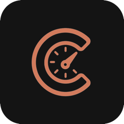
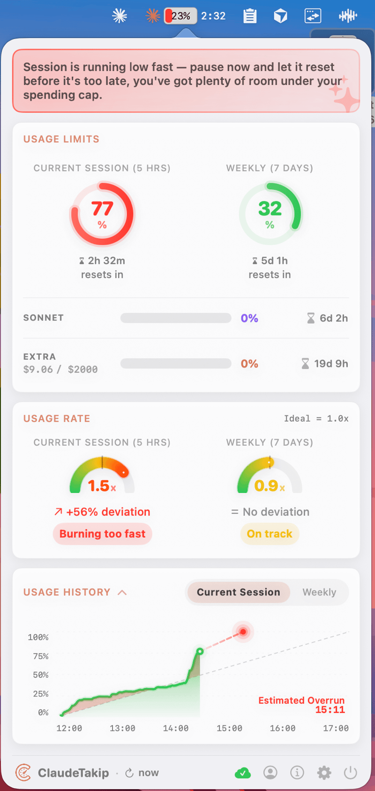

<p align="center">
  
</p>

<h1 align="center">ClaudeTakip</h1>

<p align="center">
  Track your Claude AI usage limits live, right from your macOS menu bar.
</p>

<p align="center">
  <a href="https://github.com/BatuhanAkpunar/ClaudeTakip/releases/latest">
    
  </a>
  <a href="https://claudetakip.vercel.app">
    
  </a>
  
</p>

<p align="center">
  
</p>

---

## 🎯 What is ClaudeTakip?

ClaudeTakip is a macOS menu bar app that shows your **Claude Pro / Max usage limits in real time** — 5-hour session window, 7-day weekly quota, Sonnet usage, and overage spending — all in one compact dashboard.

> 🔒 **Runs 100% locally.** Your data never leaves your Mac. No servers, no analytics, no tracking.

## ✨ Features

- 📊 **Real-time tracking** — 5-hour session + 7-day weekly limits
- 🎯 **Burn rate gauges** — session & weekly pace speedometers
- 🤖 **AI recommendations** — pacing advice powered by Groq
- 📈 **Interactive charts** — detailed usage history
- 💳 **Overage tracking** — balance and extra-usage spending
- 🔁 **Auto-session** — automatically starts a new session when yours expires
- 🌙 **Dark mode** — follows system, configurable per-app
- 🌍 **14 languages** — EN, TR, ES, FR, DE, IT, NL, JA, KO, ZH-Hans, ZH-Hant, RU, AR, PT-BR
- 🔄 **Auto-update** — silent updates via Sparkle

## 🔄 How It Works

<p align="center">
  
</p>

1. Click the **ClaudeTakip icon** in your menu bar
2. Sign in with your **Claude account** (email or Google)
3. ClaudeTakip polls `claude.ai` every **3 minutes**
4. Usage is **cached locally** on your Mac and displayed live

All data stays on your Mac — nothing is sent to third-party servers.

## 📦 Installation

### DMG (recommended)

Download the latest `.dmg` from the [Releases page](https://github.com/BatuhanAkpunar/ClaudeTakip/releases/latest), open it, and drag ClaudeTakip into your Applications folder.

### npm

```bash
npx claudetakip@latest
```

**Requirement:** macOS 15.0 Sequoia or later.

## 🚀 Usage

1. Click the ClaudeTakip icon in your menu bar
2. Sign in with your Claude account (email or Google)
3. Your usage limits, pace, and history are displayed automatically

## 🛠️ Build from Source

```bash
brew install xcodegen
```

Then generate the Xcode project and open it:

```bash
xcodegen generate
open ClaudeTakip.xcodeproj
```

Requires Xcode 16+ and Swift 6.

## 🔐 Privacy

- Talks only to `claude.ai` (usage data) and `status.claude.com` (system status)
- AI recommendations use **anonymized usage percentages** via Groq — no account info is sent
- Credentials are stored locally on your Mac with restricted file permissions
- **No analytics, no telemetry, no tracking** of any kind

## ℹ️ About

- 🌐 **Website:** [claudetakip.vercel.app](https://claudetakip.vercel.app)
- 👤 **Author:** Batuhan Akpunar — [LinkedIn](https://www.linkedin.com/in/batuhanakpunar/)
